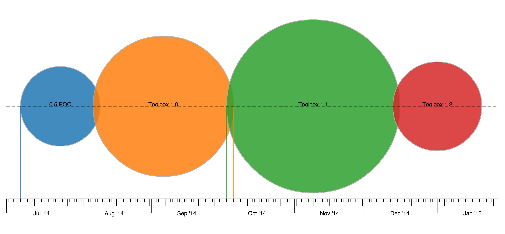

# Roadmap Bubble Chart

### Description
My mentor requested that I try out the D3 Javascript library to replicate a bubble chart given in a design. I did some research on the equations involved as well as asking my mentor how they wanted it to work in particular. The bubble chart takes in JSON data and displays the results.



```javascript
[{"label":"0.5 POC","start":"07.07.2014","end":"08.10.2014","effort":25,"manpower":1},
{"label":"Toolbox 1.0","start":"08.07.2014","end":"10.07.2014","effort":44,"manpower":1},
{"label":"Toolbox 1.1","start":"10.03.2014","end":"12.16.2014","effort":53,"manpower":1},
{"label":"Toolbox 1.2","start":"12.13.2014","end":"01.20.2015","effort":27,"manpower":1}]
```